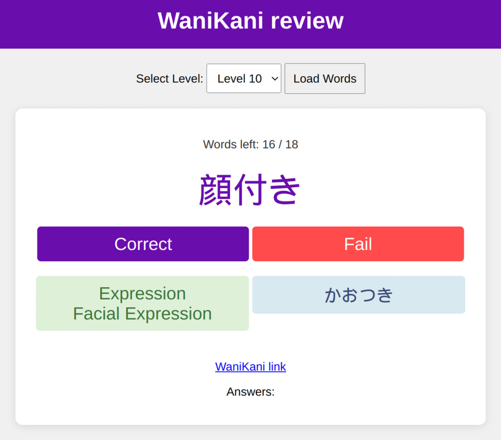

# WaniKani self study

</img>

Some scripts for getting data from the WaniKani api and a web server to self-study items with a quiz.

1. Run index.js to fetch items from the WK api for the levels defined. You must set the api token manually.

2. WK.txt contains a list of items to study. Run text_to_json.js to prepare the data for the server.

3. Run serverv2.js with node.
